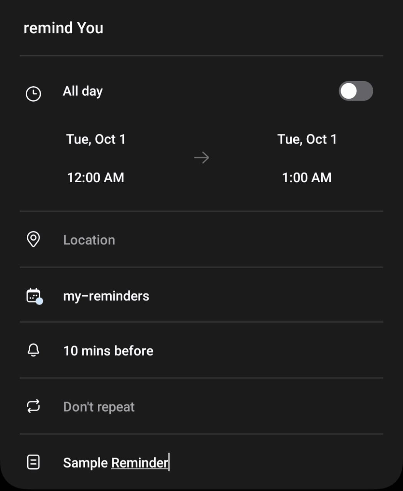

<h3 align="center"> reminder </h3>

Personal reminder system; with the help of the [`vik-caldav` (`archived`)](https://github.com/kana800/vik-caldav) and [`automate-whatsapp-message`](https://github.com/kana800/automate-whatsapp-messages) this tiny program will go through my calendar events and _log_ the events that are categorized as _reminders_. 

for example: 
1. remind `person-1` to buy milk; this will send a message `person-1` on _reminder date_.
2. remind `person-1` on their birthday;





---

### How It Works?

1. Grab all the events for today from the `CalDav` server
2. Arrange the data into format that is understood by `wa_bulk.py`
```json
{
    "person1":["message 1","message 2"],
    "person2":["message 1","message 2"]
}
```
3. send the message to `wa_bulk.py`

> above steps are carried out by [`sendreminder.ps1`](scripts/sendreminder.ps1)

### Setting Up

1. Install all the necessary modules
```bash
pip install -r requirements.txt
```
2. Create `env.py` file on the `src` and enter _login_ information of the `CalDav` Server
```py
CALURL = ""
CALPASSWORD = ""
CALUSERNAME = ""
# path where the reminder-data is saved
DATAPATH = ""
```
3. Run `main.py` to generate a `wa_bulk.py` compatible file